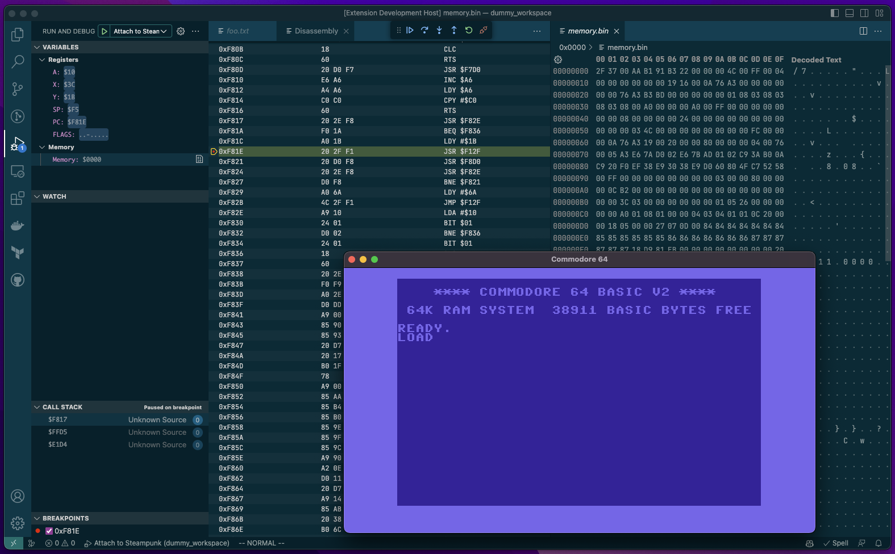

# Steampunk 6502 Debugger

This is a Visual Studio Code extension that allows debugging 6502 code using VS Code debugger and the Steampunk 6502 emulator. Note that as of now, the debugger is more mature than the emulator itself.

## Features

* Attach to a running Steampunk emulator
* Support for stepping and breakpoints
* Viewing local registers and call stack
* Memory viewer

All of these are standard features of VS Code.

## Requirements

The debugger is not (yet) capable of starting an emulator on its own; instead, you need to attach to a running instance of a [Steampunk emulator](https://github.com/bl-nero/steampunk). Both Atari 2600 and Commodore 64 are supported.

## Known Issues

The disassembly view doesn't work if no file is open in an editor. To view the disassembly:

1. Open any file (it may be a dummy text file).
2. Go to the "Run and Debug" view.
3. Right-click on a stack frame in the Call Stack view.
4. Click "Open Disassembly View".

## Release Notes

### 1.0.0

Initial release.
